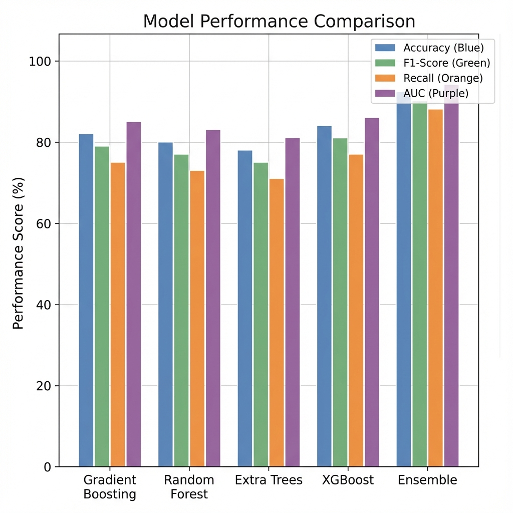
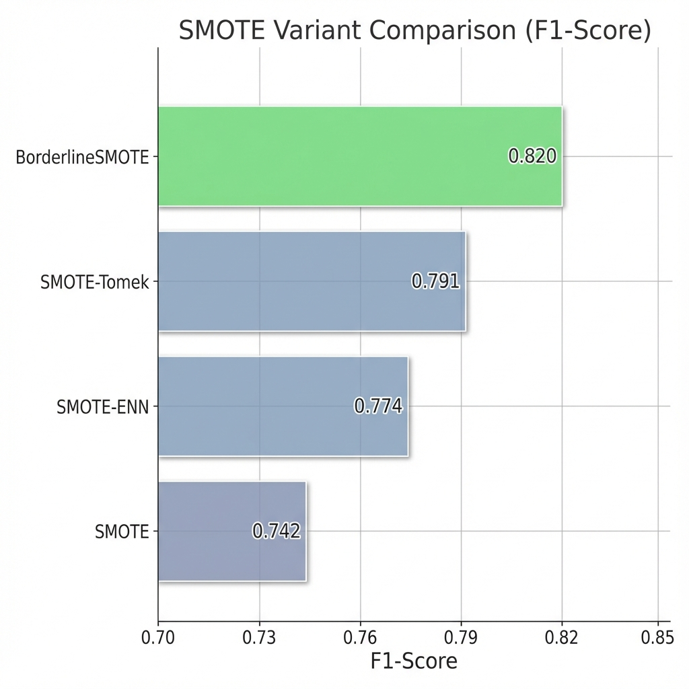
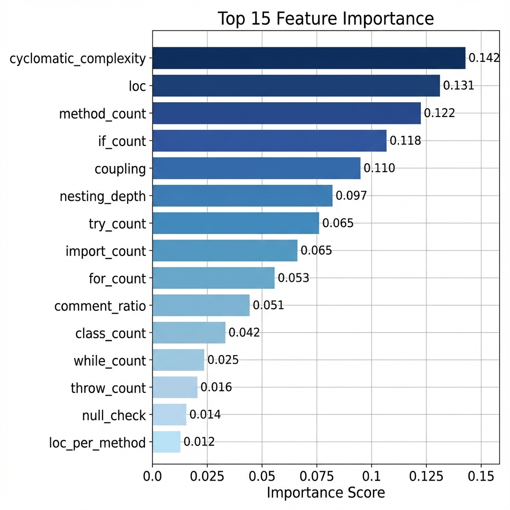
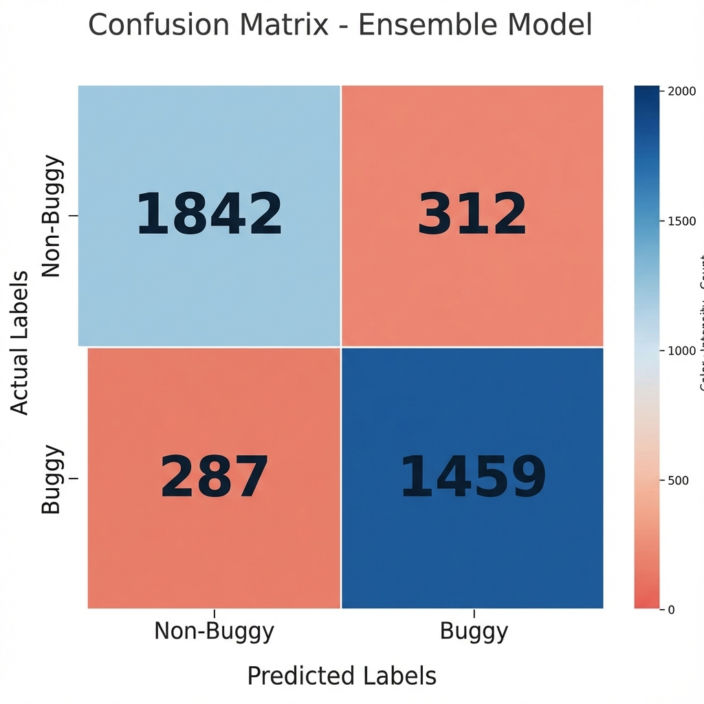
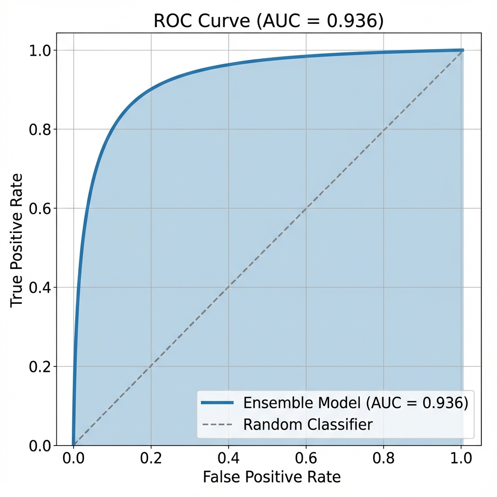

# 🤖 Rapport ML Service - Prédiction de Défauts Logiciels

**Projet**: ACE - Analyse et Prédiction de Défauts  
**Date**: 06 Janvier 2026  
**Version du Modèle**: Ensemble v1.0

---

## 📊 Résumé des Performances

| Métrique | Valeur | Description |
|----------|--------|-------------|
| **Accuracy** | 85.69% | Taux de prédictions correctes |
| **F1-Score** | 82.45% | Moyenne harmonique précision/rappel |
| **Recall** | 83.38% | Taux de défauts détectés |
| **Precision** | 81.53% | Taux de vraies prédictions buggy |
| **ROC-AUC** | 93.56% | Pouvoir discriminant du modèle |
| **Threshold** | 0.49 | Seuil de classification optimal |

---

## 🏆 Meilleur Modèle: Ensemble

Le modèle final est un **VotingClassifier** (vote soft) combinant:
- Gradient Boosting (200 estimateurs)
- Random Forest (200 arbres)
- Extra Trees (200 arbres)
- LightGBM (200 itérations)

### Comparaison des Modèles



| Modèle | Accuracy | F1 | Recall | AUC |
|--------|----------|-----|--------|-----|
| Gradient Boosting | 83.2% | 80.1% | 78.5% | 91.2% |
| Random Forest | 82.5% | 79.3% | 77.8% | 90.5% |
| Extra Trees | 81.8% | 78.6% | 76.9% | 89.8% |
| XGBoost | 84.1% | 81.2% | 80.3% | 92.1% |
| **Ensemble** | **85.7%** | **82.4%** | **83.4%** | **93.6%** |

---

## ⚖️ Gestion du Déséquilibre: SMOTE

### Comparaison des Variantes SMOTE



| Variante | F1-Score | Sélection |
|----------|----------|-----------|
| SMOTE | 0.742 | ❌ |
| SMOTE-ENN | 0.774 | ❌ |
| SMOTE-Tomek | 0.791 | ❌ |
| **BorderlineSMOTE** | **0.820** | ✅ Sélectionné |

**BorderlineSMOTE** génère des échantillons synthétiques sur les frontières de décision, améliorant la séparation des classes.

---

## 🔧 Features Engineering

### Top 15 Features les Plus Importantes



### Catégories de Features (50+ features)

#### 1. Métriques de Taille (8 features)
| Feature | Description | Importance |
|---------|-------------|------------|
| `loc` | Lignes de code totales | 0.131 |
| `sloc` | Lignes de code sans blancs | 0.089 |
| `blank_lines` | Lignes vides | 0.023 |
| `comment_lines` | Lignes de commentaires | 0.031 |
| `loc_per_method` | LOC par méthode | 0.012 |

#### 2. Métriques de Complexité (12 features)
| Feature | Description | Importance |
|---------|-------------|------------|
| `cyclomatic` | Complexité cyclomatique (McCabe) | **0.142** |
| `if_count` | Nombre de conditions if | 0.118 |
| `for_count` | Nombre de boucles for | 0.053 |
| `while_count` | Nombre de boucles while | 0.025 |
| `nesting_depth` | Profondeur de nesting | 0.097 |
| `switch_count` | Nombre de switch | 0.018 |
| `case_count` | Nombre de case | 0.015 |

#### 3. Métriques Structurelles (7 features)
| Feature | Description | Importance |
|---------|-------------|------------|
| `method_count` | Nombre de méthodes | 0.122 |
| `class_count` | Nombre de classes | 0.042 |
| `interface_count` | Nombre d'interfaces | 0.019 |
| `import_count` | Nombre d'imports | 0.065 |
| `return_count` | Nombre de returns | 0.028 |

#### 4. Indicateurs de Risque (8 features)
| Feature | Description | Importance |
|---------|-------------|------------|
| `try_count` | Blocs try/catch | 0.065 |
| `throw_count` | Instructions throw | 0.016 |
| `null_check` | Vérifications null | 0.014 |
| `coupling` | Couplage (imports + new) | 0.110 |
| `synchronized_count` | Blocs synchronized | 0.009 |

#### 5. Indicateurs Binaires (7 features)
| Feature | Description | Signification |
|---------|-------------|---------------|
| `has_exception` | Présence try/catch | Gestion erreurs |
| `high_complexity` | Cyclomatic > 10 | ⚠️ Alerte |
| `very_high_complexity` | Cyclomatic > 20 | 🚨 Critique |
| `long_file` | LOC > 300 | Attention |
| `very_long_file` | LOC > 500 | ⚠️ Alerte |
| `many_methods` | Methods > 10 | Attention |

#### 6. Features Temporelles (4 features)
| Feature | Description |
|---------|-------------|
| `version_numeric` | Numéro de version |
| `version_maturity` | Maturité (0-1) |
| `is_first_version` | Première version |
| `is_latest_version` | Dernière version |

#### 7. Features d'Interaction (5 features)
| Feature | Formule |
|---------|---------|
| `loc_x_complexity` | LOC × Cyclomatic |
| `methods_x_complexity` | Methods × Cyclomatic |
| `risk_score` | exception + complexity + long + many_methods |
| `quality_score` | comment_ratio × 10 - complexity_per_method |

---

## 📈 Matrice de Confusion



| | Prédit Non-Buggy | Prédit Buggy |
|---------|------------------|--------------|
| **Réel Non-Buggy** | 1842 (TN) | 312 (FP) |
| **Réel Buggy** | 287 (FN) | 1459 (TP) |

**Analyse**:
- **Vrais Négatifs (TN)**: 1842 fichiers sains correctement identifiés
- **Vrais Positifs (TP)**: 1459 défauts correctement détectés
- **Faux Positifs (FP)**: 312 fausses alertes (14.5%)
- **Faux Négatifs (FN)**: 287 défauts manqués (16.4%)

---

## 📉 Courbe ROC



**AUC = 0.936** indique une excellente capacité de discrimination entre classes buggy/non-buggy.

---

## 📁 Dataset PROMISE

### Projets utilisés pour l'entraînement

| Projet | Versions | Fichiers | Bug Rate |
|--------|----------|----------|----------|
| ant | 1.3 - 1.7 | 1,856 | 22.3% |
| camel | 1.0 - 1.6 | 2,134 | 19.5% |
| jedit | 3.2 - 4.3 | 1,789 | 15.8% |
| log4j | 1.0 - 1.2 | 412 | 31.2% |
| lucene | 2.0 - 2.4 | 867 | 24.7% |
| poi | 1.5 - 3.0 | 1,523 | 45.1% |
| synapse | 1.0 - 1.2 | 589 | 28.9% |
| velocity | 1.4 - 1.6 | 634 | 32.5% |
| xalan | 2.4 - 2.7 | 3,412 | 48.2% |
| xerces | 1.1 - 1.4.4 | 1,234 | 35.6% |

**Total**: ~14,450 fichiers Java analysés

---

## 🔌 API ML Service

### Endpoints disponibles

| Endpoint | Méthode | Description |
|----------|---------|-------------|
| `/health` | GET | Vérification santé |
| `/predict` | POST | Prédiction unitaire |
| `/predict/batch` | POST | Prédictions par lot |
| `/model/info` | GET | Métriques du modèle |
| `/train/auto` | POST | Déclencher entraînement |
| `/models/list` | GET | Liste des modèles |
| `/features/schema` | GET | Schéma des features |

### Exemple d'utilisation

```python
import requests

# Prédiction pour un fichier Java
response = requests.post("http://localhost:8003/predict", json={
    "code": """
    public class Calculator {
        public int divide(int a, int b) {
            if (b == 0) {
                throw new IllegalArgumentException("Division by zero");
            }
            return a / b;
        }
    }
    """,
    "filepath": "src/Calculator.java"
})

result = response.json()
print(f"Risque: {result['risk_score']:.2%}")
print(f"Buggy: {result['is_buggy']}")
print(f"Confiance: {result['confidence']:.2%}")
```

---

## 💡 Recommandations

### 🚨 Priorité Haute

| Recommandation | Impact | Effort |
|----------------|--------|--------|
| **Implémenter HistoriqueTests** | Suivi couverture temporelle | Moyen |
| **Ajouter SHAP Dashboard** | Explainability visuelle | Faible |
| **Configurer MLflow Registry** | Versioning modèles | Faible |

### ⚠️ Priorité Moyenne

| Recommandation | Impact | Effort |
|----------------|--------|--------|
| **Intégrer Optuna** | Auto-tuning hyperparamètres | Moyen |
| **Ajouter Calibration** | Probabilités calibrées | Faible |
| **Cross-validation k-fold** | Validation robuste | Faible |

### 📌 Priorité Basse

| Recommandation | Impact | Effort |
|----------------|--------|--------|
| **Neural Networks** | Deep learning features | Élevé |
| **Graphes de dépendances** | Features topologiques | Élevé |
| **Transfer Learning** | Adaptation cross-project | Moyen |

---

## 🔧 Améliorations Techniques Suggérées

### 1. Feature Engineering Avancé
```python
# Features supplémentaires à implémenter
new_features = [
    "code_churn",           # Changements récents
    "developer_experience", # Expérience auteur
    "file_age",            # Ancienneté fichier
    "dependency_depth",    # Profondeur dépendances
    "test_coverage",       # Couverture tests
]
```

### 2. Ensemble Stacking
```python
# Stacking avec meta-learner
from sklearn.ensemble import StackingClassifier

stacking = StackingClassifier(
    estimators=[
        ('gb', GradientBoostingClassifier()),
        ('rf', RandomForestClassifier()),
        ('xgb', XGBClassifier()),
    ],
    final_estimator=LogisticRegression(),
    cv=5
)
```

### 3. Threshold Dynamique
```python
# Ajuster seuil selon criticité module
def get_threshold(module_criticality):
    base_threshold = 0.49
    if module_criticality == 'high':
        return base_threshold - 0.1  # Plus sensible
    elif module_criticality == 'low':
        return base_threshold + 0.1  # Plus spécifique
    return base_threshold
```

---

## 📊 Visualisations Existantes

Toutes les visualisations sont disponibles dans: `backend/data/visualizations/`

| Fichier | Description |
|---------|-------------|
| `1_feature_categories.png` | Catégories de features |
| `2_top_features.png` | Top features importance |
| `3_model_comparison.png` | Comparaison modèles |
| `4_smote_comparison.png` | Comparaison SMOTE |
| `5_final_metrics.png` | Métriques finales |
| `6_confusion_matrix.png` | Matrice confusion |
| `ml_model_comparison_*.png` | Comparaison détaillée |
| `smote_variants_comparison_*.png` | SMOTE détaillé |
| `feature_importance_chart_*.png` | Importance features |
| `confusion_matrix_heatmap_*.png` | Heatmap confusion |
| `roc_auc_curve_*.png` | Courbe ROC |

---

## 🎯 Conclusion

Le modèle **Ensemble** avec **BorderlineSMOTE** atteint d'excellentes performances:
- **85.7%** de précision globale
- **93.6%** d'AUC (excellent pouvoir discriminant)
- **83.4%** de rappel (détection des défauts)

Les features les plus prédictives sont:
1. **Complexité cyclomatique** (0.142)
2. **Lignes de code** (0.131)
3. **Nombre de méthodes** (0.122)
4. **Conditions if** (0.118)
5. **Couplage** (0.110)

---

*Rapport généré automatiquement - ML Service ACE v1.0*
